

<h1>❤ Aprendizaje: manejo de API ❤</h1>

• Se utilizará éste repositorio con un proyecto funcional con la finalidad de explicar su funcionamiento para lograr la creación de una API propia.

<h2>🦴 Contexto 🦴</h2>

➤ Se desarrolló la primera versión de una API para el pet shop Pupyness Pet Caring que realiza las siguientes funcionalidades:

• Ingreso de un perrito

• Modificacion de un perrito

• Baja de un perrito

• Traer un perrito

<h2>🐕 Colección 🐕</h2>

➤ Trabajaremos con la colección perritos, cada documento perrito estará compuesto por: 

• Raza

• Color

• Peso

• Apodos (array de strings)

• Obediencia (array de objetos json)

• Dueño (objeto json)

➤ El frontend, a efectos de testear la base de datos, es simple y consta únicamente de botonitos con interacciones con la base de datos.

<b>NO debe permitirse el ingreso por pantalla.</b>

<h2>🐩 Nuevas funcionalidades exigidas 🐩</h2>

• Luego de una nueva reunión con el cliente, se indicó que se necesitan las siguientes funcionalidades:

➤ Muestra de todos los perritos cargados

➤ Mostrar la raza de perritos con más ingresos y su cantidad 

➤ Mostrar todos los trucos que sabe hacer el perro Lobo y los niveles correspondientes.

<h2> 🐾 Primeros pasos 🐾</h2>
<h3>➤ 1. Descargar todo el repositorio.</h3>

Separar las carpetas BACKEND y FRONTEND (en el back trabajaremos con mongo y nodejs, en el front con angular).
Es importante que creen un repositorio para el BACKEND y otro para el FRONTEND (subiremos ambos a heroku, pero separados).

<h3>➤ 2. Registrarnos en MongoDB Atlas, crear y configurar la base de datos.</h3>

• Primero entramos a https://www.mongodb.com/es/cloud/atlas y le damos al boton Start free.

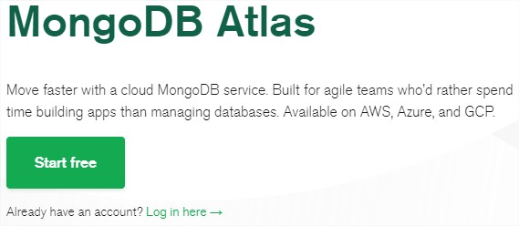

• Luego nos registramos usando nuestra cuenta de Google o llenando los datos de abajo y aceptamos los terminos.

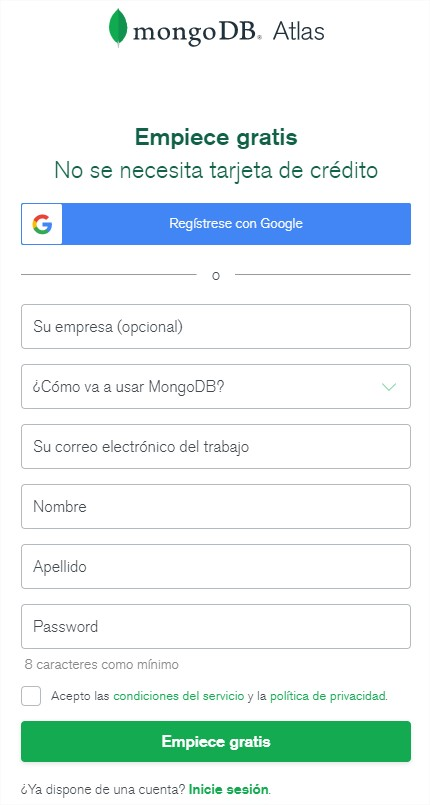

• Ahora completamos los datos que nos piden y le damos al boton de Continue.

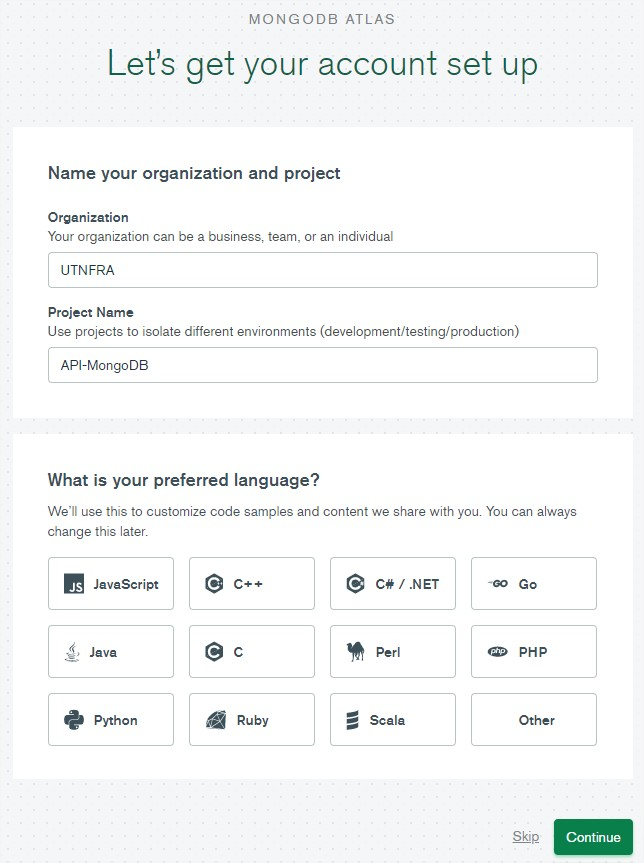

• Seleccionamos la opcion FREE y le damos a Create.

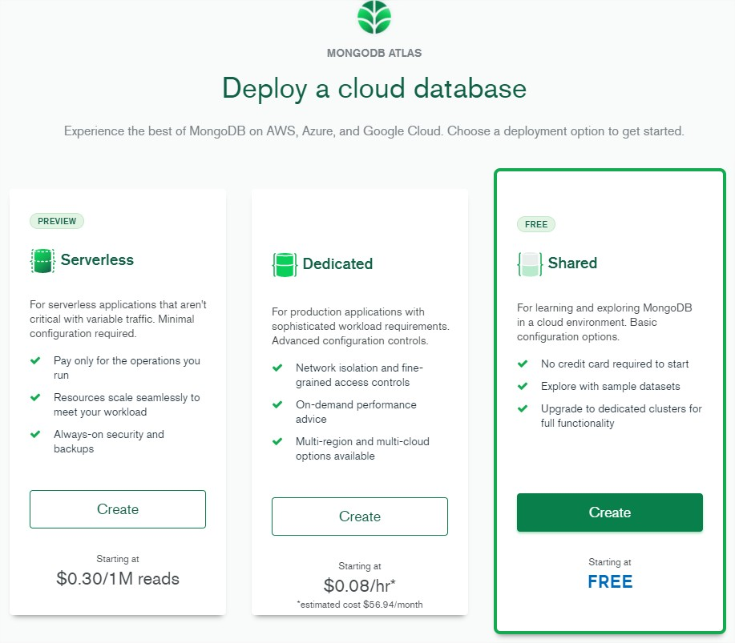

• Aca pueden elegir el proveedor, region y nombre de su Cluster. Una vez hecho esto, le damos al boton Create Cluster.

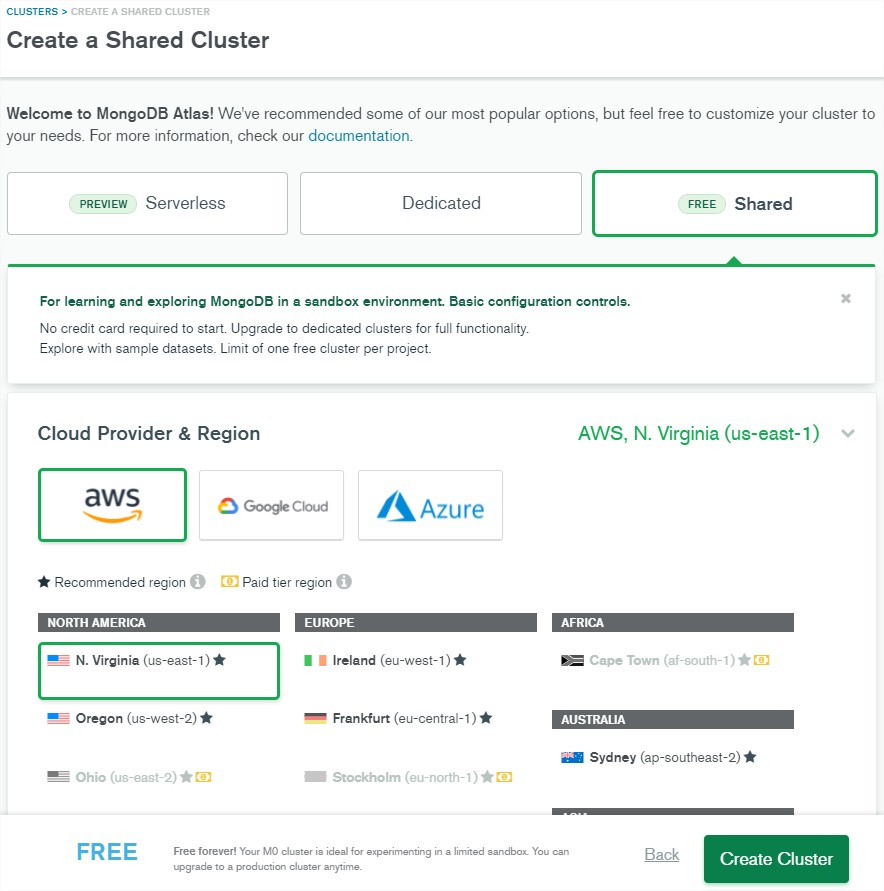

• Ahora esperamos unos minutos hasta que se haga deploy de nuestro Cluster.

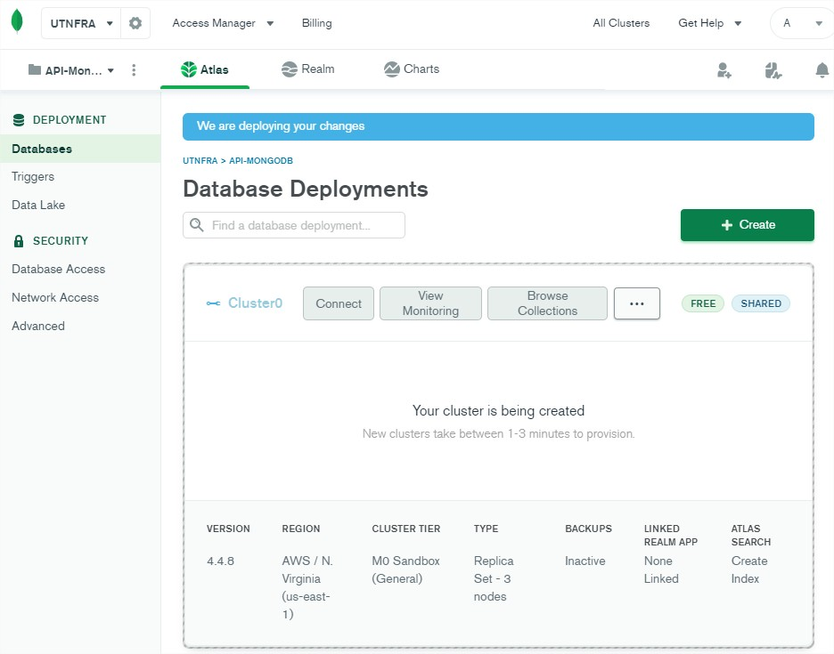

• Una vez que esté listo, le damos al boton Connect.

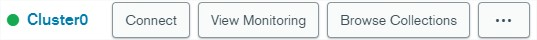

• En donde dice Add a connection IP address seleccionamos Allow Access from Anywhere.

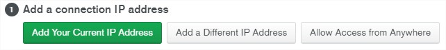

• De acá no tocamos nada y le damos a Add IP Address.

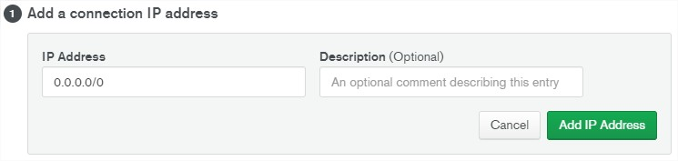

• Ahora en el apartado Create a Database User vamos a crear el usuario con el que accederemos a la base de datos (anotenselo en algun lado, es importante), le damos a Create Database User.

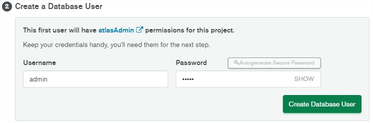

• Una vez que hemos completado estos dos pasos, ya podemos darle a Choose a connection method.

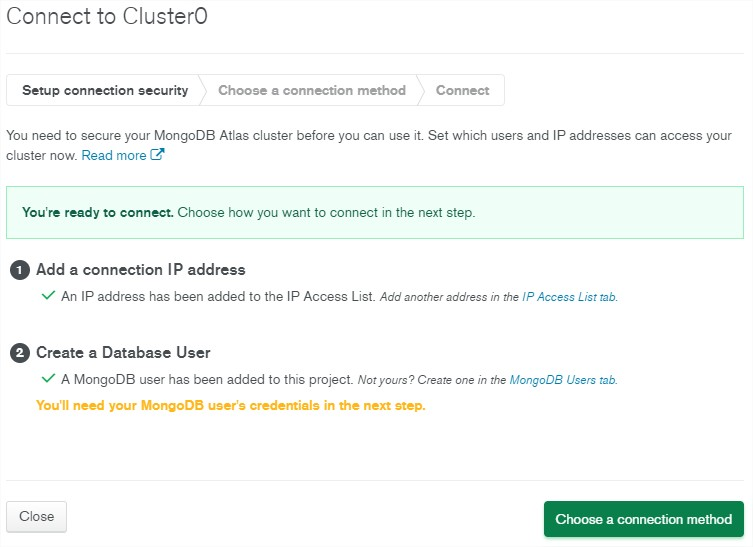

• Le damos a Connect your application.

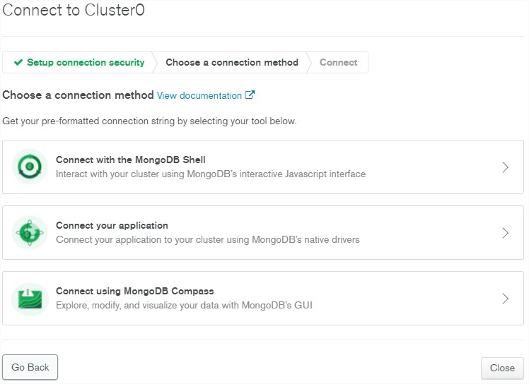

• Tambien nos anotamos el connection string que figura en el paso 2.

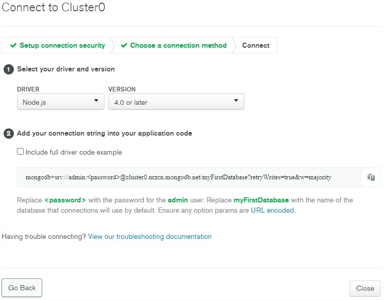

• Vamos a crear nuestra base de datos, le damos al boton Browse Collections.

• Apretamos Add My Own Data y creamos una base de datos llamada "veterinaria" y una coleccion de "perritos".

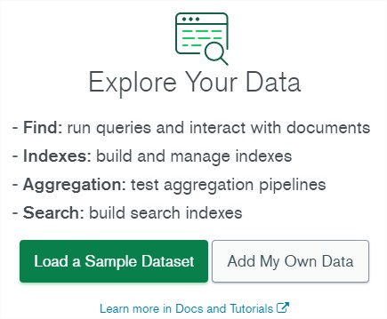
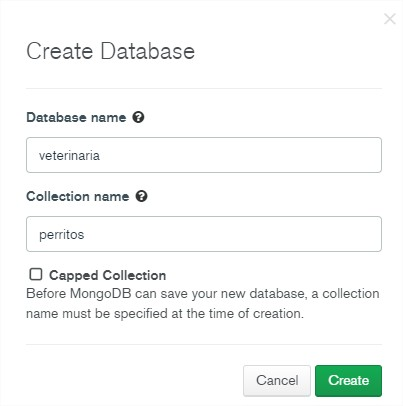
<h3>➤ 3. Instalar dependencias y conocer la estructura del BACKEND.</h3>

• Es importante que instalen NodeJS: https://nodejs.org/es/download/

• Lo primero que tenemos que hacer es abrir esta carpeta con el Visual Studio Code.

• Luego abriremos una nueva terminal.

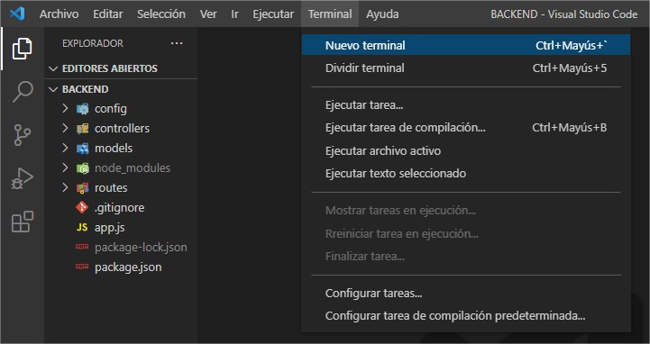

Ahora vamos a instalar las dependencias de este proyecto, para eso escribiremos:

<b>npm install</b>

• La estructura del BACKEND deberia verse asi:

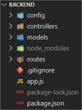

• Las carpetas y archivos que mas nos interesan son:

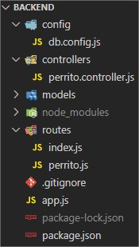

<b>config/db.config.js</b> (Configuracion de string de conexion a Atlas)

<b>controllers/perrito.controller.js</b> (Donde escribiremos todas las funciones que tienen consultas a MongoDB)

<b>routes/perrito.js</b> (Configuracion de las peticiones y a que funciones de controller llamaran)

<b>app.js</b> (La API en si, lo unico que se toca y configuran son las rutas)

• Cada archivo esta comentado para que se comprenda la manera en la que se estructura la API, en nuestro caso, una api para una veterinaria que necesita hacer consultas sobre perritos.

<h3>➤ 4. Instalar dependencias y conocer la estructura del FRONTEND.</h3>

• Este frontend esta hecho en Angular, por lo tanto, lo ideal es instalarlo: https://angular.io/

• Abrimos esta carpeta con Visual Studio Code. Instalamos las dependencias como lo hicimos antes, abriendo una terminal y escribiendo:

<b>npm install</b>

• La estructura del BACKEND debería verse asi:

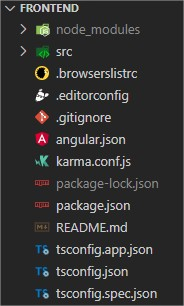

• Las carpetas y archivos que mas nos interesan son:

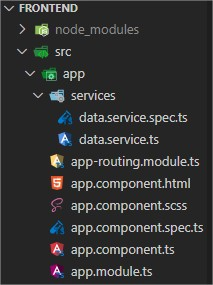

<b>src/app/services/data.service.ts</b> (Este es un servicio exclusivamente creado para realizar peticiones HTTP, nuestra api usa GET, POST, PUT y DELETE).

<b>src/app/app.component.html (Un HTML con botonitos que realizan las consultas al tocarlos).</b>

<b>src/app/app.component.ts (Aqui estara la logica necesaria para mostrar en pantalla las opciones que queramos y la funcion que realizara la peticion a nuestro BACKEND).</b>

• Aca tambien esta todo comentado para que se entienda cada cosa y como es que podemos hacer peticiones desde un FRONT a un BACK.

<h3>➤ 5. Subir BACKEND y FRONTEND a Heroku.</h3>

• Les dejaremos este repositorio donde se explica en el paso 3 cómo subir una aplicacion a heroku, deberan hacer esto tanto para el front como para el back: https://github.com/flippiJS/nodejs-mongodb-heroku

• Obviamente podríamos correr ésta API localmente. Para ello, el string de conexión quedaría conectado a nuestro Cluster, pero en lugar de usar heroku, basta con abrir el terminal con el BACKEND en Visual y escribir el siguiente comando:

<b>npm start</b>

• Nuestra API estará disponible en el puerto especificado en el proyecto. De esta manera, desde nuestro navegador podemos escribir las rutas para ver los cambios reflejados en nuestra base de datos.

• Si quisieramos tambien correr localmente nuestro frontend, desde Visual debemos abrir un terminal y escribir:

<b>ng start</b>

• Así, en el puerto especificado, estará disponible nuestro front para ser testeado (recuerden cambiar app.component.ts para pegarle a localhost en las peticiones!!!).

